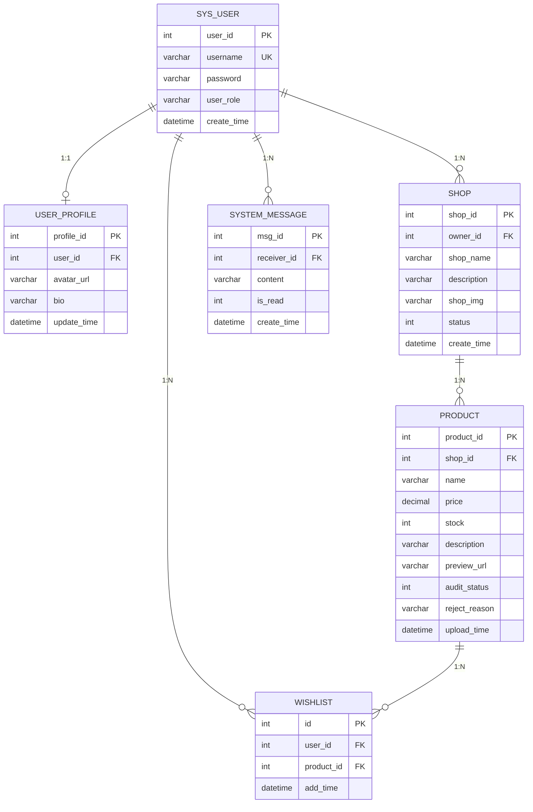

# 数据库 E-R 图

## 实体关系总览



## 实体详细说明

### 1. SysUser（用户表）

| 字段名 | 数据类型 | 约束 | 说明 |
|--------|----------|------|------|
| user_id | INT | PK, AUTO_INCREMENT | 用户ID，主键 |
| username | VARCHAR(50) | NOT NULL, UNIQUE | 用户名，唯一 |
| password | VARCHAR(255) | NOT NULL | BCrypt加密后的密码 |
| user_role | VARCHAR(20) | NOT NULL, DEFAULT 'user' | 角色：admin/shop_owner/user |
| create_time | DATETIME | DEFAULT CURRENT_TIMESTAMP | 创建时间 |

**角色说明**：
- `admin` - 系统管理员
- `shop_owner` - 店铺所有者
- `user` - 普通用户

### 2. UserProfile（用户资料表）

| 字段名 | 数据类型 | 约束 | 说明 |
|--------|----------|------|------|
| profile_id | INT | PK, AUTO_INCREMENT | 资料ID，主键 |
| user_id | INT | NOT NULL, FK | 关联sys_user.user_id |
| avatar_url | VARCHAR(500) | DEFAULT '' | 头像URL |
| bio | VARCHAR(500) | DEFAULT '' | 个人简介/签名 |
| update_time | DATETIME | ON UPDATE CURRENT_TIMESTAMP | 资料更新时间 |

**外键关系**：
- `user_id` → `sys_user.user_id` (ON DELETE CASCADE)

### 3. Shop（店铺表）

| 字段名 | 数据类型 | 约束 | 说明 |
|--------|----------|------|------|
| shop_id | INT | PK, AUTO_INCREMENT | 店铺ID，主键 |
| owner_id | INT | NOT NULL, FK | 店主用户ID |
| shop_name | VARCHAR(100) | NOT NULL | 店铺名称 |
| description | VARCHAR(500) | DEFAULT '' | 店铺介绍 |
| shop_img | VARCHAR(500) | DEFAULT '' | 店铺展示图片URL |
| status | INT | DEFAULT 1 | 营业状态：0-休息中，1-营业中 |
| create_time | DATETIME | DEFAULT CURRENT_TIMESTAMP | 开店时间 |

**外键关系**：
- `owner_id` → `sys_user.user_id` (ON DELETE CASCADE)

### 4. Product（商品表）

| 字段名 | 数据类型 | 约束 | 说明 |
|--------|----------|------|------|
| product_id | INT | PK, AUTO_INCREMENT | 商品ID，主键 |
| shop_id | INT | NOT NULL, FK | 所属店铺ID |
| name | VARCHAR(100) | NOT NULL | 商品名称 |
| price | DECIMAL(10,2) | DEFAULT 0.00 | 价格 |
| stock | INT | DEFAULT 0 | 库存数量 |
| description | VARCHAR(500) | DEFAULT '' | 商品详情描述 |
| preview_url | VARCHAR(500) | DEFAULT '' | 商品预览图URL |
| audit_status | INT | DEFAULT 0 | 审核状态：0-待审，1-通过，2-拒绝 |
| reject_reason | VARCHAR(500) | DEFAULT '' | 拒绝原因 |
| upload_time | DATETIME | DEFAULT CURRENT_TIMESTAMP | 上传/申请时间 |

**外键关系**：
- `shop_id` → `shop.shop_id` (ON DELETE CASCADE)

**审核状态说明**：
- `0` - 待审核
- `1` - 审核通过
- `2` - 审核拒绝

### 5. Wishlist（愿望单表）

| 字段名 | 数据类型 | 约束 | 说明 |
|--------|----------|------|------|
| id | INT | PK, AUTO_INCREMENT | 记录ID，主键 |
| user_id | INT | NOT NULL, FK | 用户ID |
| product_id | INT | NOT NULL, FK | 商品ID |
| add_time | DATETIME | DEFAULT CURRENT_TIMESTAMP | 收藏时间 |

**外键关系**：
- `user_id` → `sys_user.user_id` (ON DELETE CASCADE)
- `product_id` → `product.product_id` (ON DELETE CASCADE)

**唯一约束**：
- `UNIQUE(user_id, product_id)` - 防止重复添加同一商品

### 6. SystemMessage（系统消息表）

| 字段名 | 数据类型 | 约束 | 说明 |
|--------|----------|------|------|
| msg_id | INT | PK, AUTO_INCREMENT | 消息ID，主键 |
| receiver_id | INT | NOT NULL, FK | 接收者用户ID |
| content | VARCHAR(500) | NOT NULL | 消息内容 |
| is_read | INT | DEFAULT 0 | 是否已读：0-未读，1-已读 |
| create_time | DATETIME | DEFAULT CURRENT_TIMESTAMP | 消息生成时间 |

**外键关系**：
- `receiver_id` → `sys_user.user_id` (ON DELETE CASCADE)

## 实体关系详解

### 1:1 关系 - 用户与用户资料

```
SysUser (user_id) ←→ (user_id) UserProfile
```

- 每个用户有且仅有一个用户资料
- 用户资料依赖于用户存在（级联删除）

### 1:N 关系 - 用户与店铺

```
SysUser (user_id) 1 ←→ N Shop (owner_id)
```

- 一个用户可以拥有多个店铺（代码中实际限制为1个）
- 店主通过owner_id关联店铺
- 用户删除时，其店铺一并删除

### 1:N 关系 - 店铺与商品

```
Shop (shop_id) 1 ←→ N Product (shop_id)
```

- 一个店铺可以发布多个商品
- 店铺删除时，其商品一并删除

### 1:N 关系 - 用户与愿望单

```
SysUser (user_id) 1 ←→ N Wishlist (user_id)
Product (product_id) 1 ←→ N Wishlist (product_id)
```

- 一个用户可以有多个愿望单记录
- 一个商品可以被多个用户收藏
- 用户删除时，其愿望单记录一并删除
- 商品删除时，关联的愿望单记录一并删除

### 1:N 关系 - 用户与系统消息

```
SysUser (user_id) 1 ←→ N SystemMessage (receiver_id)
```

- 一个用户可以收到多条系统消息
- 用户删除时，其收到的消息一并删除

## 数据库表汇总

| 序号 | 表名 | 中文名 | 主键 | 外键数量 |
|------|------|--------|------|----------|
| 1 | sys_user | 用户表 | user_id | 0 |
| 2 | user_profile | 用户资料表 | profile_id | 1 |
| 3 | shop | 店铺表 | shop_id | 1 |
| 4 | product | 商品表 | product_id | 1 |
| 5 | wishlist | 愿望单表 | id | 2 |
| 6 | system_message | 系统消息表 | msg_id | 1 |

## 完整性约束

### 主键约束
- `sys_user.user_id`
- `user_profile.profile_id`
- `shop.shop_id`
- `product.product_id`
- `wishlist.id`
- `system_message.msg_id`

### 唯一约束
- `sys_user.username` - 用户名唯一
- `wishlist(user_id, product_id)` - 防止重复收藏

### 外键约束（级联删除）
| 父表 | 子表 | 约束字段 |
|------|------|----------|
| sys_user | user_profile | user_id |
| sys_user | shop | owner_id |
| sys_user | wishlist | user_id |
| sys_user | system_message | receiver_id |
| shop | product | shop_id |
| product | wishlist | product_id |

## 索引设计

| 表名 | 索引类型 | 索引字段 |
|------|----------|----------|
| sys_user | UNIQUE | username |
| user_profile | INDEX | user_id |
| shop | INDEX | owner_id |
| product | INDEX | shop_id |
| product | INDEX | audit_status |
| wishlist | UNIQUE | (user_id, product_id) |
| system_message | INDEX | receiver_id |
