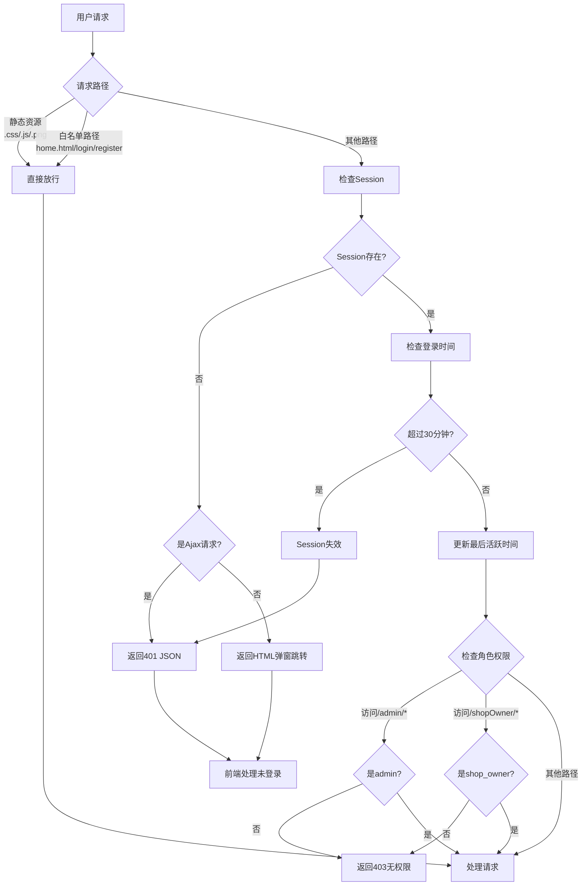
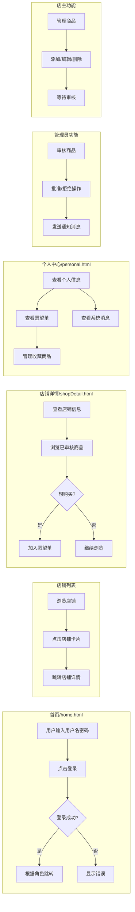
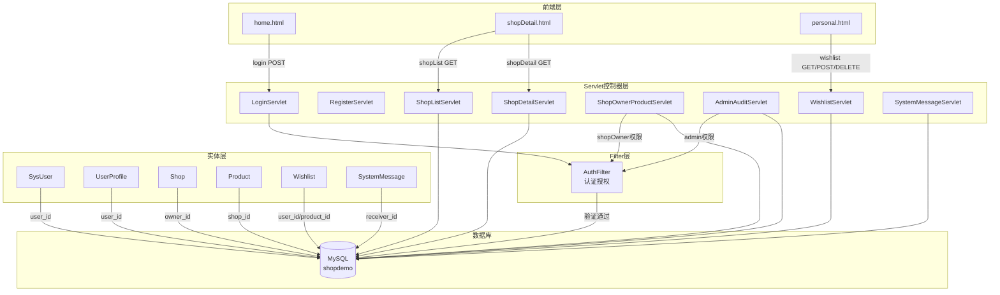

# 系统流程图

## 1. 用户认证流程

### 1.1 注册流程

```mermaid
flowchart TD
    A[用户打开注册页面] --> B[输入用户名和密码]
    B --> C[前端校验输入]
    C --> D{用户名是否合法?}
    D -->|否| E[提示错误信息]
    D -->|是| F[提交注册请求]
    F --> G[/register POST]
    G --> H[检查用户名是否存在]
    H --> I{用户名已存在?}
    I -->|是| J[返回409错误]
    I -->|否| K[BCrypt加密密码]
    K --> L[插入sys_user表]
    L --> M{插入成功?}
    M -->|是| N[返回200注册成功]
    M -->|否| O[返回500系统错误]
    J --> P[前端显示错误]
    N --> Q[跳转至登录页]
    O --> P
```

### 1.2 登录流程

```mermaid
flowchart TD
    A[用户打开首页] --> B[输入用户名和密码]
    B --> C[提交登录请求]
    C --> D[/login POST]
    D --> E[查询sys_user表]
    E --> F{用户存在?}
    F -->|否| G[返回401用户名或密码错误]
    F -->|是| H[BCrypt验证密码]
    H --> I{密码正确?}
    I -->|否| G
    I -->|是| J[创建Session]
    J --> K[写入currentUser对象]
    K --> L[创建Cookie记录登录信息]
    L --> M[返回200和用户角色]
    G --> N[前端显示错误]
    M --> O{role = admin?}
    O -->|是| P[跳转管理员页面]
    O -->|否| Q{role = shop_owner?}
    Q -->|是| R[跳转店主页面]
    Q -->|否| S[跳转普通用户页面]
```

## 2. 店铺浏览流程

```mermaid
flowchart TD
    A[用户访问首页home.html] --> B[加载店铺列表]
    B --> C[/shopList GET]
    C --> D[查询shop表<br/>JOIN sys_user获取店主名]
    D --> E[返回店铺JSON数据]
    E --> F[前端渲染店铺卡片]
    F --> G[用户点击店铺]
    G --> H[跳转shopDetail.html<br/>传递shopId参数]
    H --> I[/shopDetail GET<br/>shopId=?]
    I --> J[查询店铺信息]
    J --> K[检查用户角色]
    K --> L{是店主本人?}
    L -->|是| M[查询全部商品<br/>含待审核/已拒绝]
    L -->|否| N[只查询已审核商品<br/>audit_status=1]
    M --> O[返回店铺+商品列表]
    N --> O
    O --> P[前端展示店铺详情]
```

## 3. 商品审核流程

```mermaid
flowchart TD
    A[店主登录] --> B[进入商品管理页面]
    B --> C[/shopOwner/product GET]
    C --> D[验证shop_owner角色]
    D --> E[查询店主店铺]
    E --> F[查询店铺商品]
    F --> G[前端展示商品列表]

    G --> H[点击添加商品]
    H --> I[填写商品信息]
    I --> J[/shopOwner/product POST<br/>action=add]
    J --> K[插入product表<br/>audit_status=0待审核]
    K --> L[插入system_message<br/>通知审核状态]
    L --> M[返回成功消息]
    M --> N[前端提示已提交审核]

    P[管理员登录] --> Q[进入审核页面]
    Q --> R[/admin/audit GET]
    R --> S[查询待审核商品<br/>audit_status=0]
    S --> T[前端展示待审核列表]

    T --> U[选择审核操作]
    U --> V{批准或拒绝?}

    V -->|批准| W[/admin/audit POST<br/>action=approve]
    W --> X[更新audit_status=1]
    X --> Y[插入通过消息<br/>至system_message]
    Y --> Z[返回审核成功]

    V -->|拒绝| AA[/admin/audit POST<br/>action=reject]
    AA --> AB[更新audit_status=2<br/>记录reject_reason]
    AB --> AC[插入拒绝消息<br/>至system_message]
    AC --> Z

    Z --> AE[前端更新列表]
```

## 4. 愿望单管理流程

```mermaid
flowchart TD
    A[用户浏览商品] --> B[点击加入愿望单]
    B --> C[/wishlist POST<br/>productId=?]
    C --> D[检查登录状态]
    D --> E{已登录?}
    E -->|否| F[返回401未登录]
    E -->|是| G[检查商品库存]
    G --> H{库存充足?}
    H -->|否| I[返回400商品已售罄]
    H -->|是| J[检查是否已在愿望单]
    J --> K{已在愿望单?}
    K -->|是| L[返回400重复添加]
    K -->|否| M[插入wishlist表]
    M --> N[扣减商品库存<br/>stock - 1]
    N --> O[返回200添加成功]

    P[用户查看愿望单] --> Q[/wishlist GET]
    Q --> R[查询用户愿望单<br/>JOIN product表]
    R --> S[前端展示收藏商品]

    S --> T[点击移除商品]
    T --> U[/wishlist DELETE<br/>productId=?]
    U --> V[删除wishlist记录]
    V --> W[恢复商品库存<br/>stock + 1]
    W --> X[返回200移除成功]
```

## 5. 系统消息流程

```mermaid
flowchart TD
    A[系统事件触发] --> B{事件类型}

    B -->|商品审核通过| C[插入消息<br/>receiver=店主]
    B -->|商品审核拒绝| D[插入消息<br/>receiver=店主+拒绝原因]
    B -->|商品提交审核| E[插入消息<br/>receiver=店主]

    C --> F
    D --> F
    E --> F[system_message表存储]

    G[店主查看消息] --> H[/messages GET]
    H --> I[查询当前用户消息]
    I --> J[按时间倒序返回]
    J --> K[前端展示消息列表]
    K --> L[用户点击查看详情]
```

## 6. 认证过滤器流程



## 7. 用户交互完整流程



## 8. 数据流向图


